# Event Sourcing with PostgreSQL

- [Introduction](#0b79795d3efc95b9976c7c5b933afce2)
- [Example Domain](#8753dff3c2879207fa06ef1844b1ea4d)
- [Event Sourcing and CQRS 101](#19025f75ca30ec4a46f55a6b9afdeba6)
  - [State-Oriented Persistence](#436b314e78fec59a76bad8b93b52ee75)
  - [Event Sourcing](#c4b3d1c8edab1825366ac1d541d8226f)
  - [CQRS](#b2cf9293622451d86574d2973398ca70)
  - [Advantages of CQRS](#cc00871be6276415cfb13eb24e97fe48)
  - [Advantages of Event Sourcing](#845b7e034fb763fcdf57e9467c0a8707)
- [Requirements for Event Store](#70b356f41293ace9df0d04cd8175ac35)
- [Solution Architecture](#9f6302143996033ebb94d536b860acc3)
  - [Permanent Storage](#205928bf89c3012be2e11d1e5e7ad01f)
  - [Optimistic concurrency control](#6eec4db0e612f3a70dab7d96c463e8f6)
  - [Loading current state](#323effe18de24bcc666f161931c903f3)
  - [Subscribe to all events by aggregate type](#784ff5dca3b046266edf61637822bbff)
  - [Checkpoints](#0b584912c4fa746206884e080303ed49)
  - [Snapshotting](#e8e27b68d6e2d74d28c14c40a36b9f63)
  - [Drawbacks](#0cfc0523189294ac086e11c8e286ba2d)
- [How to Run the Sample?](#53af957fc9dc9f7083531a00fe3f364e)

<!-- Table of contents is made with https://github.com/evgeniy-khist/markdown-toc -->

## <a id="0b79795d3efc95b9976c7c5b933afce2"></a>Introduction

Usually, our applications operate with the current state of a domain object. But sometimes, we need to know the entire history of the domain object changes. For example, we want to know how an order got into its current state.

We can store all changes to the domain object state as a sequence of events in an append-only event stream. Thus, event streams will contain an entire history of changes. But how can we be sure that this history is authentic and free from errors? We can use event streams as a primary source of truth in a system. To get the current state of an object, we have to replay all events in the order of occurrence. This pattern is called event sourcing. Database for storing the event streams is called even store.

There are specialized databases for event sourcing. Developer Advocates working for the companies behind these specialized databases tell you that you shouldn't implement event sourcing with traditional relational or document-oriented databases. Is it true or just a marketing ploy? In fact, you can implement event sourcing with any database. The repositories in this series provide samples of event sourced systems that use different databases as event store.

PostgreSQL is the world's most advanced open source database. Also, PostgreSQL is suitable for event
sourcing.

This repository provides a sample of event sourced system that uses PostgreSQL as event store.


See also

* [Event Sourcing with EventStoreDB](https://github.com/evgeniy-khist/eventstoredb-event-sourcing)
* [Event Sourcing with Kafka and ksqlDB](https://github.com/evgeniy-khist/ksqldb-event-souring)

## <a id="8753dff3c2879207fa06ef1844b1ea4d"></a>Example Domain

This sample uses a simple domain model inspired by my work experience in a ride-hailing company.

* A rider can place an order for a ride along a route specifying a price.
* A rider can edit order price to pay more instead of waiting in cases of very high demand.
* A driver can accept and complete an order.
* An order can be cancelled before completion.

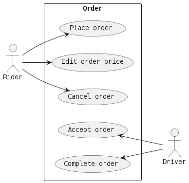

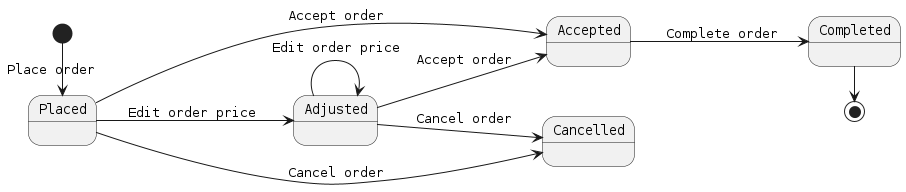

## <a id="19025f75ca30ec4a46f55a6b9afdeba6"></a>Event Sourcing and CQRS basics

### <a id="436b314e78fec59a76bad8b93b52ee75"></a>State-Oriented Persistence

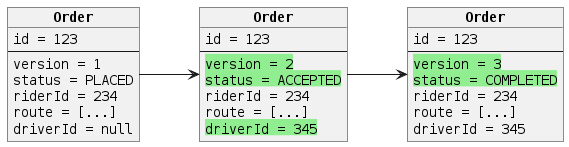

### <a id="c4b3d1c8edab1825366ac1d541d8226f"></a>Event Sourcing

Event sourcing persists the state of an entity as a sequence of immutable state-changing events.


Whenever the state of an entity changes, a new event is appended to the list of events.

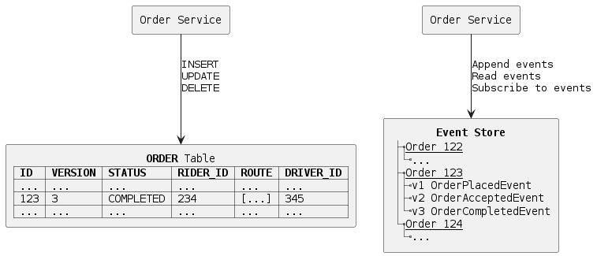

Current state of an entity can be restored by replaying all its events.

An entity in event sourcing is also referenced as an **aggregate**.

A sequence of events for the same aggregate are also referenced as a **stream**.

Event sourcing is best suited for short-living entities with a small total number of
events (e.g. orders).

Restoring the state of the short-living entity by replaying all its events doesn't have any
performance impact. Thus, no optimizations for restoring state are required for short-living
entities.

For endlessly stored entities (e.g. users, bank accounts) with thousands of events restoring state
by replaying all events is not optimal and snapshotting should be considered.

### Snapshotting

Snapshotting is an optimization technique where a snapshot of the aggregate's state is also saved,
so an application can restore the current state of an aggregate from the snapshot instead of from
scratch.

On every *nth* event, make an aggregate snapshot by storing an aggregate state and its version.

To restore an aggregate state:

1. first read the latest snapshot,
2. then read events forward from the original stream starting from the version pointed by the snapshot.

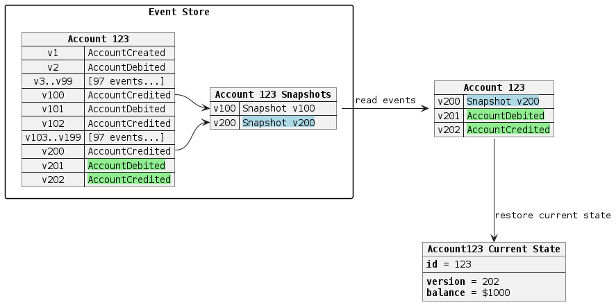

### <a id="b2cf9293622451d86574d2973398ca70"></a>CQRS

CQRS (Command-query responsibility segregation) stands for segregating the responsibility between
commands (write requests) and queries (read requests). The write requests and the read requests are
processed by different handlers.

A command generates zero or more events or results in an error.

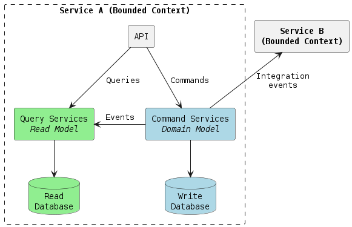

CQRS is a self-sufficient architectural pattern and doesn't require event sourcing.

Event sourcing is usually used in conjunction with CQRS. Event store is used as a write database and
SQL or NoSQL database as a read database.

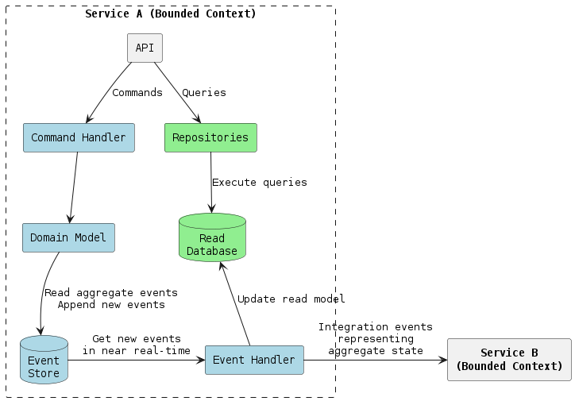

Events in event sourcing are a part of a bounded context and should not be used "as-is" for
integration with other bounded contexts. Integration events representing the current state of an
aggregate should be used for communication between bounded contexts instead of a raw event sourcing
change events.

### <a id="cc00871be6276415cfb13eb24e97fe48"></a>Advantages of CQRS

* Independent scaling of the read and write databases.
* Optimized data schema for the read database (e.g. the read databases can be denormalized).
* Simpler queries (e.g. complex `JOIN` operations can be avoided).

### <a id="845b7e034fb763fcdf57e9467c0a8707"></a>Advantages of Event Sourcing

* Having a true history of the system (audit and traceability).
* Ability to put the system in any prior state (e.g. for debugging).
* Read-side projections can be created as needed (later) from events. It allows responding to future
  needs and new requirements.
  
The majority of developers I interviewed highlight having a true history of the system as the main advantage 
of event sourcing.

## <a id="70b356f41293ace9df0d04cd8175ac35"></a>Requirements for Event Store

* Permanent storage. Store events forever.
* Optimistic concurrency control. Prevent lost update anomaly (write-write conflicts).
* Loading current state. Loading all previous events for the particular aggregate ID from an event
  store.
* Subscribe to all events by aggregate type. Instead of subscribing to a single event stream that
  represents an aggregate.
* Checkpoints. Store the event offset (a position in the stream) after handling it. Subscribe from
  the last known position instead of the stream start after the application restart.

## <a id="9f6302143996033ebb94d536b860acc3"></a>Solution Architecture

PostgreSQL can be used as an event store. It will natively support appending events, concurrency
control and reading events. Subscribing on events requires additional implementation.

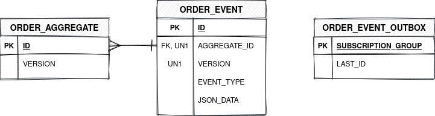

Separate table `ORDER_AGGREGATE` keeps track of the latest versions of the aggregates. It is
required for optimistic concurrency control.

PostgreSQL doesn't allow subscribing on changes, so the solution is Transactional outbox pattern. A
service that uses a database inserts events into an outbox table as part of the local transaction. A
separate Message Relay process publishes the events inserted into database to a message broker.

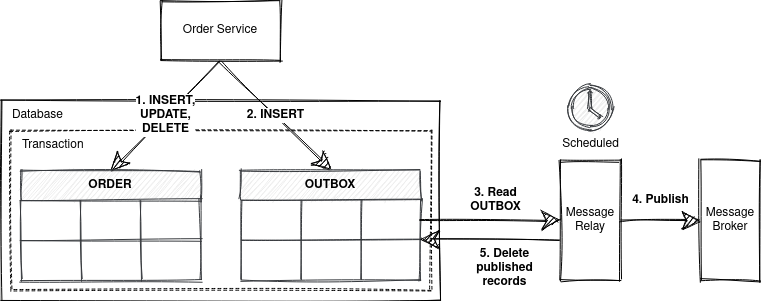

With event sourcing database model classical Transaction outbox pattern can be simplified even more.
An outbox table is used to keep track of handled events. Outbox handler (aka Message Relay and
Polling Publisher) processes new events by polling the database's outbox table.

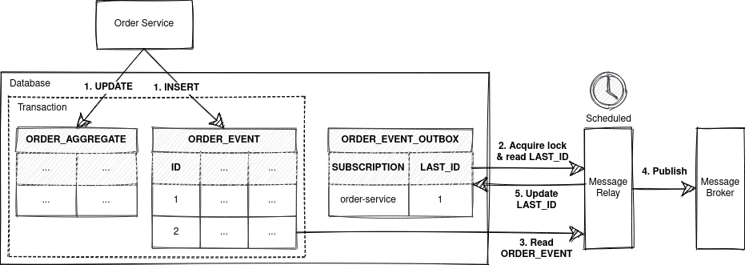

Event processing includes updating the read model and publishing integration events.

All parts together look like this

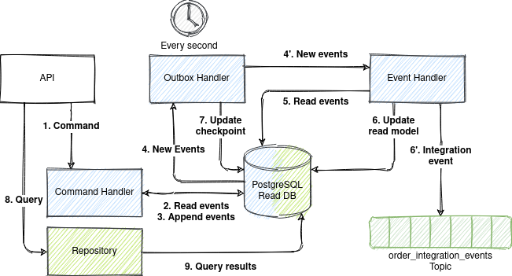

### <a id="205928bf89c3012be2e11d1e5e7ad01f"></a>Permanent Storage

PostgreSQL stores all data permanently be default.

### <a id="6eec4db0e612f3a70dab7d96c463e8f6"></a>Optimistic concurrency control

Optimistic concurrency control is done by checking aggregate versions in the `ORDER_AGGREGATE`
table.

Appending an event operation consists of 2 SQL statements in a single transaction:

1. Check the actual and expected version match and increment version
    ```sql
    UPDATE ORDER_AGGREGATE SET VERSION = VERSION + 1 WHERE ID = ? AND VERSION = ?
    ```
2. Insert new event
    ```sql
    INSERT INTO ORDER_EVENT(AGGREGATE_ID, VERSION, EVENT_TYPE, JSON_DATA) VALUES(?, ?, ?, ?)
    ```

### <a id="323effe18de24bcc666f161931c903f3"></a>Loading current state

Current state of an aggregate can be loaded using simple query that fetches all aggregate events
order by version in the ascending order

```sql
SELECT ID,
       EVENT_TYPE,
       JSON_DATA
  FROM ORDER_EVENT
 WHERE AGGREGATE_ID = ?
 ORDER BY VERSION ASC
```

### <a id="784ff5dca3b046266edf61637822bbff"></a>Subscribe to all events by aggregate type

PostgreSQL doesn't allow subscribing on changes, so the solution is Transactional outbox pattern or
its variations.

`ORDER_EVENT_OUTBOX` table keeps track of all subscribers (consumer groups) and the last processed
event ID.

The concept of consumer groups is required to deliver events to only one consumer from the group.
This is achieved by acquiring a locking on the same record of `ORDER_EVENT_OUTBOX` table.

Outbox handler polls `ORDER_EVENT_OUTBOX` table every second for new events and processes them

1. Read the last processed event ID and acquire lock
    ```sql
    SELECT LAST_ID
      FROM ORDER_EVENT_OUTBOX
     WHERE SUBSCRIPTION_GROUP = ?
       FOR UPDATE NOWAIT
    ```
2. Fetch new events
    ```sql
    SELECT ID,
           EVENT_TYPE,
           JSON_DATA
      FROM ORDER_EVENT
     WHERE ID > ?
     ORDER BY ID ASC
    ```
3. Update the ID of the last event processed by the subscription
    ```sql
    UPDATE ORDER_EVENT_OUTBOX
       SET LAST_ID = ?
     WHERE SUBSCRIPTION_GROUP = ?
    ```

### <a id="0b584912c4fa746206884e080303ed49"></a>Checkpoints

The last known position from where the subscription starts getting events is stored in `LAST_ID`
column of `ORDER_EVENT_OUTBOX` table.

### <a id="e8e27b68d6e2d74d28c14c40a36b9f63"></a>Snapshotting

Snapshotting is important for long-living or endlessly stored aggregates as we do not want to replay
all the events (potentially thousands) to restore an aggregate state every time.

EventStoreDB doesn't provide snapshotting functionality out of the box, but you can easily implement
it by yourself.

On every *nth* event append an aggregate state (snapshot) to a separate stream specifying the
revision.

To restore an aggregate state:

1. first read the latest value of the snapshot stream (backwards),
2. then read forward from the original stream from the revision the snapshot points to.

### <a id="0cfc0523189294ac086e11c8e286ba2d"></a>Drawbacks

1. The asynchronous replication leads to the eventual consistency between the write and read models.
   But polling database's *outbox* table for new messages with a fixed delay introduces pretty big
   full consistency lag (greater than or equal to the fixed delay between polls).
2. **The Outbox handler might process an event more than once.** It might crash after processing an
   event but before recording the fact that it has done so. When it restarts, it will then process
   the same event again (update the read model and send an integration event).

Integration events are delivered with at-least-once delivery guarantee. The exactly-once delivery
guarantee is hard to achieve due to a dual-write. A dual-write describes a situation when you need
to atomically update the database and publish messages and two-phase commit (2PC) is not an option.

Consumers of integration events should be idempotent and filter duplicates and unordered events.

## <a id="53af957fc9dc9f7083531a00fe3f364e"></a>How to Run the Sample?

1. Download & install [SDKMAN!](https://sdkman.io/install).

2. Install JDK 17
    ```bash
    sdk list java
    sdk install java 17.0.x-tem
    ```

3. Install [Docker](https://docs.docker.com/engine/install/)
   and [Docker Compose](https://docs.docker.com/compose/install/).

4. Build Java project and Docker image
    ```bash
    ./gradlew clean build jibDockerBuild -i
    ```

5. Run PostgreSQL, Kafka and event-sourcing-app
    ```bash
    docker compose --env-file gradle.properties up -d --scale event-sourcing-app=2
    # wait a few minutes
    ```

6. Follow the logs of the application
    ```bash
    docker compose logs -f event-sourcing-app
    ```

7. Install [curl](https://curl.se/) and [jq](https://stedolan.github.io/jq/).
    ```bash
    sudo apt install curl jq
    ```

8. Run [`test.sh`](test.sh) script and see the output.
    ```bash
    ./test.sh
    ```

The `test.sh` script has the following instructions:

1. Place new order.
    ```bash
    ORDER_ID=$(curl -s -X POST http://localhost:8080/orders/ -d '{"riderId":"63770803-38f4-4594-aec2-4c74918f7165","price":"123.45","route":[{"address":"Kyiv, 17A Polyarna Street","lat":50.51980052414157,"lon":30.467197278948536},{"address":"Kyiv, 18V Novokostyantynivska Street","lat":50.48509161169076,"lon":30.485170724431292}]}' -H 'Content-Type: application/json' | jq -r .orderId)
    sleep 2s
    ```

2. Get the placed order.
    ```bash
    curl -s -X GET http://localhost:8080/orders/$ORDER_ID | jq
    ```
    ```json
    {
      "id": "466aafd1-288c-4299-be26-3be0c9c5aef1",
      "version": 1,
      "status": "PLACED",
      "riderId": "63770803-38f4-4594-aec2-4c74918f7165",
      "price": 123.45,
      "route": [
        {
          "address": "Kyiv, 17A Polyarna Street",
          "lat": 50.51980052414157,
          "lon": 30.467197278948536
        },
        {
          "address": "Kyiv, 18V Novokostyantynivska Street",
          "lat": 50.48509161169076,
          "lon": 30.485170724431292
        }
      ],
      "placedDate": "2021-04-25T16:51:52.680374Z"
    }
    ```

3. Accept the order.
    ```bash
    curl -s -X PATCH http://localhost:8080/orders/$ORDER_ID -d '{"status":"ACCEPTED","driverId":"2c068a1a-9263-433f-a70b-067d51b98378","version":1}' -H 'Content-Type: application/json'
    sleep 2s
    ```

4. Get the accepted order.
    ```bash
    curl -s -X GET http://localhost:8080/orders/$ORDER_ID | jq
    ```
    ```json
    {
      "id": "466aafd1-288c-4299-be26-3be0c9c5aef1",
      "version": 2,
      "status": "ACCEPTED",
      "riderId": "63770803-38f4-4594-aec2-4c74918f7165",
      "price": 123.45,
      "route": [
        {
          "address": "Kyiv, 17A Polyarna Street",
          "lat": 50.51980052414157,
          "lon": 30.467197278948536
        },
        {
          "address": "Kyiv, 18V Novokostyantynivska Street",
          "lat": 50.48509161169076,
          "lon": 30.485170724431292
        }
      ],
      "driverId": "2c068a1a-9263-433f-a70b-067d51b98378",
      "placedDate": "2021-04-25T16:51:52.680374Z",
      "acceptedDate": "2021-04-25T16:51:55.114824Z"
    }
    ```

5. Try to cancel an outdated version of the order to simulate lost update.
    ```bash
    curl -s -X PATCH http://localhost:8080/orders/$ORDER_ID -d '{"status":"CANCELLED","version":1}' -H 'Content-Type: application/json' | jq
    ```
    ```json
    {
      "error": "Actual version doesn't match expected version 1"
    }
    ```

6. Try to cancel a version of the order 'from the future' to simulate unordering.
    ```bash
    curl -s -X PATCH http://localhost:8080/orders/$ORDER_ID -d '{"status":"CANCELLED","version":3}' -H 'Content-Type: application/json' | jq
    ```
    ```json
    {
      "error": "Actual version doesn't match expected version 3"
    }
    ```

7. Complete the order.
    ```bash
    curl -s -X PATCH http://localhost:8080/orders/$ORDER_ID -d '{"status":"COMPLETED","version":2}' -H 'Content-Type: application/json'
    sleep 2s
    ```

8. Get the completed order.
    ```bash
    curl -s -X GET http://localhost:8080/orders/$ORDER_ID | jq
    ```
    ```json
    {
      "id": "466aafd1-288c-4299-be26-3be0c9c5aef1",
      "version": 3,
      "status": "COMPLETED",
      "riderId": "63770803-38f4-4594-aec2-4c74918f7165",
      "price": 123.45,
      "route": [
        {
          "address": "Kyiv, 17A Polyarna Street",
          "lat": 50.51980052414157,
          "lon": 30.467197278948536
        },
        {
          "address": "Kyiv, 18V Novokostyantynivska Street",
          "lat": 50.48509161169076,
          "lon": 30.485170724431292
        }
      ],
      "driverId": "2c068a1a-9263-433f-a70b-067d51b98378",
      "placedDate": "2021-04-25T16:51:52.680374Z",
      "acceptedDate": "2021-04-25T16:51:55.114824Z",
      "completedDate": "2021-04-25T16:51:57.314153Z"
    }
    ```

9. Try to cancel a completed order to simulate business rule violation.
    ```bash
    curl -s -X PATCH http://localhost:8080/orders/$ORDER_ID -d '{"status":"CANCELLED","version":3}' -H 'Content-Type: application/json' | jq
    ```
    ```json
    {
      "error": "Order in status COMPLETED can't be cancelled"
    }
    ```

10. Print integration events.
    ```bash
    docker exec -it kafka /bin/kafka-console-consumer --bootstrap-server localhost:9092 --topic order-integration-events --from-beginning --property print.key=true --timeout-ms 10000
    ```
    ```
    466aafd1-288c-4299-be26-3be0c9c5aef1	{"order_id":"466aafd1-288c-4299-be26-3be0c9c5aef1","event_type":"OrderPlacedEvent","event_timestamp":1619369512680,"version":1,"status":"PLACED","rider_id":"63770803-38f4-4594-aec2-4c74918f7165","price":123.45,"route":[{"ADDRESS":"Kyiv, 17A Polyarna Street","LAT":50.51980052414157,"LON":30.467197278948536},{"ADDRESS":"Kyiv, 18V Novokostyantynivska Street","LAT":50.48509161169076,"LON":30.485170724431292}]}
    466aafd1-288c-4299-be26-3be0c9c5aef1	{"order_id":"466aafd1-288c-4299-be26-3be0c9c5aef1","event_type":"OrderAcceptedEvent","event_timestamp":1619369515114,"version":2,"status":"ACCEPTED","rider_id":"63770803-38f4-4594-aec2-4c74918f7165","price":123.45,"route":[{"ADDRESS":"Kyiv, 17A Polyarna Street","LAT":50.51980052414157,"LON":30.467197278948536},{"ADDRESS":"Kyiv, 18V Novokostyantynivska Street","LAT":50.48509161169076,"LON":30.485170724431292}],"driver_id":"2c068a1a-9263-433f-a70b-067d51b98378"}
    466aafd1-288c-4299-be26-3be0c9c5aef1	{"order_id":"466aafd1-288c-4299-be26-3be0c9c5aef1","event_type":"OrderCompletedEvent","event_timestamp":1619369517314,"version":3,"status":"COMPLETED","rider_id":"63770803-38f4-4594-aec2-4c74918f7165","price":123.45,"route":[{"ADDRESS":"Kyiv, 17A Polyarna Street","LAT":50.51980052414157,"LON":30.467197278948536},{"ADDRESS":"Kyiv, 18V Novokostyantynivska Street","LAT":50.48509161169076,"LON":30.485170724431292}],"driver_id":"2c068a1a-9263-433f-a70b-067d51b98378"}
    ```
